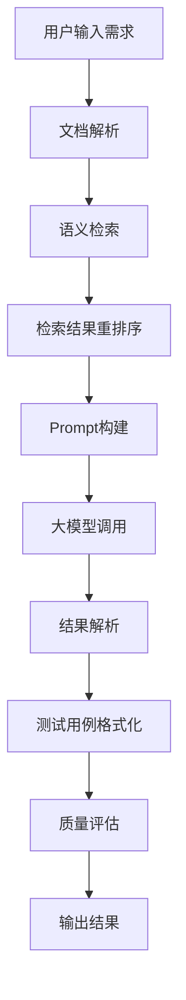

# RAG + Dify测试案例生成平台可行性方案

## 项目概述

本项目旨在构建一个基于 RAG（检索增强生成）和 Dify 平台的 AI 自动测试用例生成系统，能够从需求文档、接口定义、历史测试用例等知识库中智能检索相关信息，结合大语言模型生成高质量、全覆盖的测试用例。

## 技术架构设计

### 整体架构图

```Plain Text

┌─────────────────────────────────────────────────────────────┐
│                    测试用例生成平台                          │
├─────────────────────────────────────────────────────────────┤
│  前端层：Web界面/API接口                                    │
│  ├─ 用户交互界面                                            │
│  ├─ 文档上传功能                                            │
│  ├─ 测试用例预览与导出                                      │
│  └─ 配置管理界面                                            │
├─────────────────────────────────────────────────────────────┤
│  业务逻辑层：Dify平台核心引擎                                │
│  ├─ 工作流编排引擎                                          │
│  ├─ RAG检索增强模块                                         │
│  ├─ 大语言模型调用层                                        │
│  └─ 插件集成框架                                            │
├─────────────────────────────────────────────────────────────┤
│  数据层：知识库与向量数据库                                  │
│  ├─ 原始文档存储                                            │
│  ├─ 向量索引数据库                                          │
│  ├─ 测试用例库                                              │
│  └─ 历史数据仓库                                            │
├─────────────────────────────────────────────────────────────┤
│  基础设施层：容器化部署                                      │
│  ├─ Docker容器编排                                          │
│  ├─ 监控与日志                                              │
│  └─ 备份与恢复                                              │
└─────────────────────────────────────────────────────────────┘
```

### 核心组件说明

#### 1. 前端层

- **用户交互界面**：基于 React/Vue.js 构建的现代化 Web 界面

- **文档上传功能**：支持 PDF、Word、Markdown 等多种格式文档上传

- **测试用例预览与导出**：支持在线预览和导出 XMind、Excel、CSV 等格式

- **配置管理界面**：模型参数、检索策略、生成规则的可视化配置

#### 2. 业务逻辑层

- **工作流编排引擎**：Dify 内置的可视化工作流设计器

- **RAG 检索增强模块**：实现文档向量化、语义检索、结果重排序

- **大语言模型调用层**：支持多种 LLM 模型的统一调用接口

- **插件集成框架**：支持自定义插件扩展功能

#### 3. 数据层

- **原始文档存储**：使用 MinIO 或 S3 存储原始文档

- **向量索引数据库**：使用 Chroma 或 Milvus 存储向量索引

- **测试用例库**：使用 PostgreSQL 存储结构化测试用例

- **历史数据仓库**：存储生成记录、用户反馈、评估结果

## 技术选型

### 大语言模型选型

#### 方案一：云原生方案（推荐）

- **主模型**：GPT-4 Turbo / Claude 3 Opus

- **嵌入模型**：OpenAI text-embedding-3-large

- **优势**：性能优异，开箱即用，维护成本低

- **适用场景**：企业级生产环境，对质量要求高

#### 方案二：开源方案

- **主模型**：Llama-3-70B / Qwen2-72B

- **嵌入模型**：BGE-large-zh-v1.5 / Qwen3-Embedding

- **优势**：本地化部署，数据安全可控

- **适用场景**：对数据隐私要求高的企业

### 向量数据库选型

|数据库|特点|适用场景|
|---|---|---|
|**Chroma**|轻量级，易于部署，适合小规模数据|开发环境，小型项目|
|**Milvus**|分布式，支持亿级向量检索|大规模生产环境|
|**Pinecone**|托管服务，无需运维|快速上线，不想维护基础设施|
|**Weaviate**|语义搜索引擎，支持混合检索|复杂检索场景|
### 技术栈推荐

#### 后端技术栈

- **框架**：FastAPI + Python

- **数据库**：PostgreSQL + Redis

- **向量数据库**：Chroma（开发）/ Milvus（生产）

- **消息队列**：RabbitMQ / Redis

- **监控**：Prometheus + Grafana

#### 前端技术栈

- **框架**：React 18 + TypeScript

- **UI 组件库**：Ant Design / MUI

- **状态管理**：Zustand / Redux Toolkit

- **构建工具**：Vite

#### 部署方案

- **容器化**：Docker + Docker Compose

- **编排**：Kubernetes（生产环境）

- **CI/CD**：GitHub Actions / GitLab CI

## 实施步骤

### 第一阶段：环境搭建（1-2 周）

#### 1. Dify 平台部署

```bash

# 使用Docker Compose部署Dify
git clone https://github.com/langgenius/dify.git
cd dify
docker-compose up -d
```

#### 2. 向量数据库部署

```bash

# 部署Chroma（开发环境）
docker run -d -p 8000:8000 chromadb/chroma

# 部署Milvus（生产环境）
wget https://github.com/milvus-io/milvus/releases/download/v2.4.0/milvus-standalone-docker-compose.yml
docker-compose -f milvus-standalone-docker-compose.yml up -d
```

#### 3. 模型配置

- 在 Dify 控制台配置模型供应商

- 设置 API 密钥和访问权限

- 测试模型连通性

### 第二阶段：知识库构建（2-3 周）

#### 1. 文档收集与整理

- 产品需求文档（PRD）

- 接口设计文档（API 文档）

- 数据库设计文档

- 历史测试用例

- 缺陷报告和修复记录

- 行业标准和规范

#### 2. 文档预处理

```python

# 文档预处理示例
from langchain.text_splitter import RecursiveCharacterTextSplitter
from langchain.document_loaders import PyPDFLoader

# 加载PDF文档
loader = PyPDFLoader("requirements.pdf")
documents = loader.load()

# 文本分块
text_splitter = RecursiveCharacterTextSplitter(
    chunk_size=1000,
    chunk_overlap=200,
    length_function=len,
)
chunks = text_splitter.split_documents(documents)
```

#### 3. 知识库创建

- 在 Dify 中创建多个知识库（按业务模块划分）

- 配置分块策略和嵌入模型

- 上传文档并构建向量索引

- 测试检索效果

### 第三阶段：工作流设计（2-3 周）

#### 1. 测试用例生成工作流


#### 2. 工作流节点配置

- **文档解析节点**：提取文本内容和元数据

- **语义检索节点**：使用混合检索（关键词 + 向量）

- **重排序节点**：使用 CrossEncoder 进行结果重排序

- **Prompt 构建节点**：动态生成高质量 Prompt

- **大模型调用节点**：调用指定的 LLM 模型

- **结果解析节点**：解析模型输出并结构化

- **质量评估节点**：评估生成用例的质量

- **输出节点**：格式化输出并存储

#### 3. Prompt 模板设计

```Plain Text

基于以下需求文档和历史测试用例，生成完整的测试用例：

【需求文档片段】
{retrieved_requirements}

【历史测试用例】
{retrieved_test_cases}

【测试用例模板】
用例编号：
用例名称：
测试场景：
前置条件：
测试步骤：
预期结果：
优先级：
测试类型：

【生成要求】
1. 覆盖所有功能点和边界条件
2. 遵循公司测试用例编写规范
3. 每个用例独立可执行
4. 包含正常、异常、边界场景
5. 用例名称清晰明确
6. 预期结果具体可验证

请生成符合要求的测试用例：
```

### 第四阶段：功能开发（3-4 周）

#### 1. 前端开发

- 文档上传界面

- 测试用例生成界面

- 用例管理界面

- 配置管理界面

- 结果展示和导出界面

#### 2. 后端开发

- 文档上传 API

- 测试用例生成 API

- 用例管理 API

- 质量评估 API

- 回调和 Webhook 接口

#### 3. 集成开发

- 与 Dify 平台集成

- 与向量数据库集成

- 与测试管理系统集成

- 与 CI/CD 流水线集成

### 第五阶段：测试与优化（2-3 周）

#### 1. 功能测试

- 文档上传功能测试

- 用例生成功能测试

- 检索准确性测试

- 导出功能测试

#### 2. 性能测试

- 响应时间测试

- 并发用户测试

- 文档处理能力测试

- 向量检索性能测试

#### 3. 质量评估

- 用例覆盖率评估

- 用例质量评估

- 模型输出准确性评估

- 用户满意度调研

#### 4. 优化迭代

- 检索策略优化

- Prompt 工程优化

- 模型参数调优

- 性能瓶颈优化

### 第六阶段：上线部署（1-2 周）

#### 1. 生产环境部署

- 容器化部署

- 负载均衡配置

- 监控告警配置

- 备份策略配置

#### 2. 数据迁移

- 知识库数据迁移

- 历史数据导入

- 配置参数迁移

#### 3. 培训与推广

- 用户培训

- 文档编写

- 推广活动

- 反馈收集

## 关键技术实现

### RAG 检索增强

#### 1. 文档向量化

```python

from langchain.embeddings import HuggingFaceEmbeddings

# 初始化嵌入模型
embeddings = HuggingFaceEmbeddings(
    model_name="BAAI/bge-large-zh-v1.5",
    model_kwargs={"device": "cuda"},
    encode_kwargs={"normalize_embeddings": True}
)

# 生成文档向量
document_vector = embeddings.embed_query("测试用例生成")
```

#### 2. 混合检索策略

```python

from langchain.retrievers import BM25Retriever, EnsembleRetriever
from langchain.vectorstores import Chroma

# 向量检索
vector_retriever = Chroma.from_documents(
    documents, embeddings
).as_retriever(k=5)

# BM25关键词检索
bm25_retriever = BM25Retriever.from_documents(documents, k=5)

# 混合检索
ensemble_retriever = EnsembleRetriever(
    retrievers=[vector_retriever, bm25_retriever],
    weights=[0.7, 0.3]
)
```

#### 3. 结果重排序

```python

from sentence_transformers import CrossEncoder

# 初始化重排序模型
reranker = CrossEncoder("cross-encoder/ms-marco-MiniLM-L-6-v2")

# 对检索结果重排序
def rerank_results(query, results):
    pairs = [(query, result.page_content) for result in results]
    scores = reranker.predict(pairs)
    
    # 按分数排序
    sorted_results = sorted(
        zip(results, scores), 
        key=lambda x: x[1], 
        reverse=True
    )
    
    return [result for result, score in sorted_results]
```

### 测试用例生成

#### 1. 结构化输出

```python

from pydantic import BaseModel, Field
from typing import List, Optional

class TestCase(BaseModel):
    """测试用例数据模型"""
    case_id: str = Field(description="用例编号")
    case_name: str = Field(description="用例名称")
    test_scenario: str = Field(description="测试场景")
    preconditions: List[str] = Field(description="前置条件")
    test_steps: List[str] = Field(description="测试步骤")
    expected_results: List[str] = Field(description="预期结果")
    priority: str = Field(description="优先级", enum=["P0", "P1", "P2"])
    test_type: str = Field(description="测试类型", enum=["功能测试", "接口测试", "性能测试"])
    tags: List[str] = Field(description="标签")

class TestCaseResponse(BaseModel):
    """测试用例响应模型"""
    test_cases: List[TestCase] = Field(description="测试用例列表")
    coverage_rate: float = Field(description="覆盖率")
    generation_time: float = Field(description="生成时间")
```

#### 2. 质量评估

```python

import re
from rouge import Rouge

def evaluate_test_case_quality(generated_cases, requirements):
    """评估测试用例质量"""
    rouge = Rouge()
    
    # 覆盖率计算
    requirement_points = extract_requirement_points(requirements)
    covered_points = count_covered_points(generated_cases, requirement_points)
    coverage_rate = covered_points / len(requirement_points)
    
    # 质量评分
    quality_scores = []
    for case in generated_cases:
        # 用例名称清晰度
        name_score = evaluate_case_name(case.case_name)
        
        # 步骤完整性
        step_score = evaluate_step_completeness(case.test_steps)
        
        # 预期结果明确性
        result_score = evaluate_result_clarity(case.expected_results)
        
        # 综合评分
        total_score = (name_score + step_score + result_score) / 3
        quality_scores.append(total_score)
    
    avg_quality_score = sum(quality_scores) / len(quality_scores)
    
    return {
        "coverage_rate": coverage_rate,
        "avg_quality_score": avg_quality_score,
        "quality_scores": quality_scores
    }
```

## 最佳实践

### 1. 知识库管理

#### 文档分类策略

- **按业务模块分类**：用户管理、订单管理、支付系统等

- **按文档类型分类**：需求文档、接口文档、测试用例等

- **按更新频率分类**：静态文档、动态文档、实时文档

#### 文档更新机制

- **自动同步**：从 Confluence、Jira 等系统自动同步文档

- **版本控制**：维护文档版本历史，支持版本对比

- **变更通知**：文档变更时自动触发用例更新

### 2. 检索策略优化

#### 权重配置

- **业务重要性权重**：核心业务模块设置更高权重

- **更新时间权重**：近期更新的文档设置更高权重

- **检索效果权重**：根据历史检索效果动态调整权重

#### 检索范围控制

- **上下文过滤**：根据用户角色和权限过滤检索结果

- **时间范围过滤**：只检索指定时间范围内的文档

- **标签过滤**：根据标签筛选相关文档

### 3. 生成质量优化

#### Prompt 工程

- **角色设定**："你是一位资深测试工程师，具有丰富的测试经验"

- **规则注入**：明确测试用例编写规范和公司标准

- **示例引导**：提供高质量的测试用例示例

#### 输出格式控制

- **强制结构化输出**：使用 JSON 格式或特定模板

- **格式验证**：对模型输出进行格式验证和修正

- **异常处理**：处理模型输出不符合要求的情况

### 4. 质量保障机制

#### 自动化评估

- **覆盖率评估**：自动计算用例对需求的覆盖率

- **质量评分**：使用预定义的质量标准对用例评分

- **重复检测**：检测并去除重复的测试用例

#### 人工审核

- **审核流程**：建立人工审核机制，确保用例质量

- **反馈机制**：支持用户对生成用例进行评价和反馈

- **持续改进**：基于用户反馈持续优化模型和策略

### 5. 集成与自动化

#### 测试管理系统集成

- **Jira 集成**：自动将生成的用例导入 Jira

- **TestLink 集成**：与 TestLink 等测试管理系统无缝集成

- **缺陷管理集成**：从缺陷报告中学习并优化用例

#### CI/CD 集成

- **自动化触发**：代码提交时自动生成新的测试用例

- **流水线集成**：将用例生成集成到 CI/CD 流水线中

- **回归测试**：自动生成回归测试用例并执行

## 项目风险与应对

### 1. 技术风险

#### 模型性能风险

- **风险描述**：大语言模型输出质量不稳定

- **应对措施**：

    - 建立模型评估和监控机制

    - 准备多个模型备选方案

    - 实施人工审核和质量控制

#### 检索准确性风险

- **风险描述**：检索结果不准确，影响用例生成质量

- **应对措施**：

    - 优化检索策略和权重配置

    - 实施检索效果监控和反馈机制

    - 提供人工调整检索结果的功能

### 2. 数据风险

#### 数据安全风险

- **风险描述**：敏感数据泄露

- **应对措施**：

    - 实施数据脱敏和加密

    - 建立严格的访问控制机制

    - 采用本地化部署方案

#### 数据质量风险

- **风险描述**：知识库数据质量不高

- **应对措施**：

    - 建立数据质量评估标准

    - 实施数据清洗和预处理

    - 建立数据审核机制

### 3. 实施风险

#### 实施周期风险

- **风险描述**：项目实施周期过长

- **应对措施**：

    - 采用敏捷开发方法，分阶段交付

    - 优先实现核心功能

    - 建立项目进度监控机制

#### 用户接受度风险

- **风险描述**：用户对 AI 生成的用例不信任

- **应对措施**：

    - 提供人工审核和修改功能

    - 逐步推广，让用户体验到价值

    - 建立用户培训和支持体系

## 项目预算与 ROI 分析

### 1. 项目预算

#### 硬件成本

- **服务器成本**：2-4 台服务器，约 10-20 万元 / 年

- **GPU 成本**：如需本地部署大模型，GPU 成本约 20-50 万元

#### 软件成本

- **大语言模型 API 费用**：按调用量计费，约 5-10 万元 / 年

- **向量数据库费用**：托管服务约 2-5 万元 / 年

- **其他软件许可费用**：约 1-3 万元 / 年

#### 人力成本

- **开发团队**：3-5 人，开发周期 6-8 个月，约 50-100 万元

- **运维团队**：1-2 人，约 20-40 万元 / 年

#### 总预算

- **一次性投入**：60-120 万元

- **年度运营成本**：30-60 万元

### 2. ROI 分析

#### 收益分析

- **人力成本节约**：减少测试用例编写时间，节约人力成本 30-50%

- **质量提升**：提高测试覆盖率，减少线上缺陷 20-40%

- **效率提升**：缩短测试周期，加快产品上线速度 20-30%

#### ROI 计算

- **投资回收期**：12-18 个月

- **3 年 ROI**：200-400%

- **5 年 ROI**：500-800%

## 总结

本方案提供了一套完整的 RAG + Dify 测试案例生成平台的技术实现方案，具有以下优势：

1. **技术先进性**：采用最新的 RAG 技术和大语言模型，确保生成质量

2. **可扩展性**：模块化设计，易于扩展和维护

3. **实用性**：结合实际测试场景，解决真实问题

4. **可落地性**：提供详细的实施步骤和技术选型建议

通过实施本项目，可以显著提高测试用例生成效率和质量，降低测试成本，提升软件产品质量，为企业带来显著的经济效益和技术价值。

建议按照方案中的分阶段实施计划，循序渐进地推进项目，确保项目成功落地并发挥预期效果。
> （注：文档部分内容可能由 AI 生成）